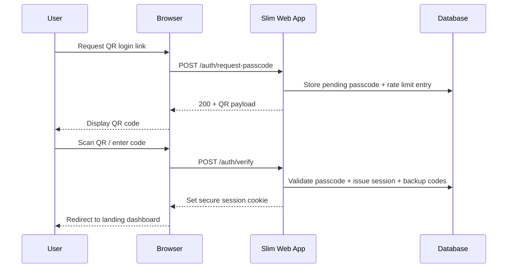

# job.smeird.com Application Guide

This repository contains the production code that powers the job.smeird.com workspace. It is a Slim 4/PHP&nbsp;7.4 application that provides passcode-based authentication, CV and job description ingestion, AI-assisted drafting, secure download links, usage analytics, and automated retention tooling.

## Overview of capabilities

* **Passwordless authentication and recovery.** Registration and login rely on short-lived QR-delivered passcodes, are rate-limited, and produce sessions plus downloadable backup codes for break-glass access.【F:src/Services/AuthService.php†L39-L205】【F:resources/views/auth/qr.php†L1-L78】
* **Safe document handling.** Uploads are capped at 1&nbsp;MiB, are limited to DOCX/PDF/Markdown/Text formats, and undergo structure checks (e.g. macro detection) before storage.【F:src/Documents/DocumentValidator.php†L11-L154】
* **Generation workflow with guarded downloads.** Tailored artefacts are produced through queued jobs and exposed through HMAC-protected links that honour per-user tokens, format scopes, and expirations.【F:database/migrations/20240401000000_jobs_overhaul.php†L6-L20】【F:src/Controllers/GenerationDownloadController.php†L29-L137】
* **Spend and token insight.** A Tailwind/Tabulator/Highcharts dashboard visualises per-call usage, running totals, and monthly aggregates sourced from the `api_usage` table.【F:resources/views/usage.php†L10-L112】【F:src/Services/UsageService.php†L20-L134】【F:src/Routes.php†L153-L154】
* **Retention governance.** A dedicated `retention_settings` table captures purge policy state and drives the CLI purge utility that clears documents, generation outputs, usage rows, and audit logs after the configured number of days.【F:src/Services/RetentionPolicyService.php†L13-L182】【F:bin/purge.php†L18-L63】

## Architecture at a glance

* A PHP-DI container wires controllers, services, repositories, and middleware inside `public/index.php`, including QR passcode provisioning, rate limiters, and download token services.【F:public/index.php†L53-L167】
* Runtime bootstrap loads environment variables and normalises the application URL for downstream consumers.【F:src/Bootstrap.php†L12-L43】
* Every HTTP request runs lightweight database migrations so runtime tables (users, pending passcodes, sessions, documents, generations, generation_outputs, api_usage, backup codes, audit logs, retention settings, jobs) exist before handling traffic.【F:public/index.php†L181-L186】【F:src/Infrastructure/Database/Migrator.php†L19-L205】
* Additional SQL migrations live in `database/migrations` and can be applied out-of-band through the `bin/migrate.php` helper, which tracks state via the `schema_migrations` table.【F:bin/migrate.php†L21-L76】
* Background work is dispatched into the `jobs` table and processed by the `bin/worker.php` daemon, which requires `pcntl` and graceful signal handling.【F:database/migrations/20240401000000_jobs_overhaul.php†L6-L20】【F:bin/worker.php†L1-L68】
* OpenAI interactions read model configuration, tariff data, and max token limits from environment variables and persist usage rows for reporting.【F:src/AI/OpenAIProvider.php†L52-L117】【F:src/Services/UsageService.php†L20-L102】

### Authentication & session lifecycle



This diagram highlights how the QR passcode flow issues authenticated sessions while keeping validation and rate-limiting logic inside the Slim-powered application.【F:public/index.php†L53-L167】【F:src/Services/AuthService.php†L39-L205】

### Document generation pipeline

```mermaid
flowchart LR
    subgraph Ingestion
        A[Upload Document] --> B[DocumentValidator]
        B -->|Valid| C[(documents table)]
    end

    subgraph Drafting
        C --> D[Queue tailor_cv job]
        D --> E[(jobs table)]
        E --> F[worker.php daemon]
        F --> G[OpenAIProvider]
    end

    subgraph Delivery
        G --> H[(generation_outputs table)]
        H --> I[Signed download token]
        I --> J[GenerationDownloadController]
        J --> K[Secure link to user]
    end

    K --> L[UsageService aggregates analytics]
```



The flowchart shows how validated uploads move through queued generation work, produce signed download artefacts, and feed analytics summarised for the dashboard.【F:src/Documents/DocumentValidator.php†L11-L154】【F:bin/worker.php†L1-L68】【F:src/AI/OpenAIProvider.php†L52-L117】【F:src/Controllers/GenerationDownloadController.php†L29-L137】【F:src/Services/UsageService.php†L20-L134】

## Requirements

### Server prerequisites

* **PHP&nbsp;7.4 CLI** – the codebase makes use of typed properties, arrow functions, and other PHP&nbsp;7.4 language features.【F:bin/verify.helpers.php†L37-L121】
* **Database** – MySQL 8.x (production) or SQLite for local experimentation; configure via DSN/driver variables.【F:src/DB.php†L36-L78】
* **Composer** – to install PHP dependencies.
* **Web server** – Apache or Nginx configured to serve the `public/` directory.

### PHP extensions

Enable or install the following extensions:

* `pdo_mysql` (or `pdo_sqlite` when using SQLite) for persistence.【F:src/DB.php†L36-L69】
* `mbstring` for multi-byte validation and extraction logic across middleware and extractors.【F:src/Middleware/InputValidationMiddleware.php†L62-L109】【F:src/Extraction/Extractor.php†L296-L319】
* `zip` and `fileinfo` to validate DOCX/PDF uploads.【F:src/Documents/DocumentValidator.php†L51-L154】
* `pcntl` for the long-running worker process.【F:bin/worker.php†L13-L34】

### Optional tooling

* Node.js is only necessary when rebuilding or customising the pre-built Tailwind assets that live under `public/assets/`.

## Installation

1. **Clone the repository**
   ```bash
   git clone https://github.com/smeird/job.git /var/www/job
   cd /var/www/job
   ```
2. **Install PHP dependencies**
   ```bash
   composer install --no-dev --optimize-autoloader
   ```
3. **Bootstrap environment variables**
   ```bash
   cp .env.example .env
   ```
   Edit `.env` to match your environment (see the configuration table below). The bootstrapper automatically reads it on each request.【F:src/Bootstrap.php†L20-L43】
4. **Run database migrations**
   ```bash
   php bin/migrate.php
   ```
   This applies the SQL migrations in `database/migrations/` so the schema matches production before traffic hits the runtime migrator.【F:bin/migrate.php†L21-L76】
5. **Set directory permissions**
   Ensure the web server user can read the codebase and write to the storage directories used for logs and cached artifacts.

After these steps, point your virtual host at `public/index.php` and restart PHP-FPM or Apache so new environment variables take effect.

## Configuration reference

| Variable | Purpose | Reference |
| --- | --- | --- |
| `APP_ENV`, `APP_DEBUG` | Standard Slim environment flags. | 【F:src/Bootstrap.php†L12-L43】 |
| `APP_URL` | Canonical URL used in redirects and CSPs. | 【F:src/Bootstrap.php†L35-L43】 |
| `APP_COOKIE_DOMAIN` | Domain used when setting secure session cookies. | 【F:public/index.php†L40-L47】 |
| `APP_KEY` / `DOWNLOAD_TOKEN_SECRET` | Secret used to sign download tokens (set at least one). | 【F:public/index.php†L158-L171】 |
| `DOWNLOAD_TOKEN_TTL` | Lifetime (seconds) for download URLs; defaults to 300. | 【F:public/index.php†L165-L169】 |
| `DB_DSN` or `DB_DRIVER` + `DB_HOST`/`DB_PORT`/`DB_DATABASE`/`DB_SOCKET`/`DB_CHARSET`/`DB_USERNAME`/`DB_PASSWORD` | Database connection settings. | 【F:src/DB.php†L36-L78】 |
| `OPENAI_API_KEY`, `OPENAI_BASE_URL`, `OPENAI_MODEL_PLAN`, `OPENAI_MODEL_DRAFT`, `OPENAI_TARIFF_JSON`, `OPENAI_MAX_TOKENS` | OpenAI credentials, endpoints, tariff data, and token ceilings. | 【F:src/AI/OpenAIProvider.php†L52-L117】 |

The application also respects `DB_DATABASE=':memory:'` when `DB_DRIVER=sqlite`, which is convenient for smoke testing.【F:src/DB.php†L41-L58】

## Database and background jobs

* The runtime migrator now provisions authentication, document, generation, analytics, retention, and job tables in lock-step with the SQL definitions, adding columns when legacy installs are detected.【F:src/Infrastructure/Database/Migrator.php†L19-L205】
* SQL migrations mirror the runtime schema so CLI-driven installs and on-request migrations converge on identical structures for analytics, retention, and background jobs.【F:database/migrations/20240326000000_initial.php†L7-L139】【F:database/migrations/20240401000000_jobs_overhaul.php†L6-L20】【F:database/migrations/20240718000001_add_generation_stream_columns.php†L1-L13】
* Run the worker under a supervisor (systemd, supervisord, etc.) using `php bin/worker.php` so queued `tailor_cv` jobs are processed continuously.【F:bin/worker.php†L29-L68】
* Example unit and environment definitions live in `resources/systemd/` to speed up provisioning of a managed worker service.【F:resources/systemd/job-worker.service.example†L1-L20】【F:resources/systemd/job-worker.env.example†L1-L16】
* Configure a cron entry to execute `php bin/purge.php` daily. It honours the active retention policy and reports how many rows were removed per resource.【F:bin/purge.php†L18-L63】

## Usage analytics & retention

* `/usage` renders a Tailwind-styled dashboard that fetches data from `/usage/data`; both routes require an authenticated session.【F:resources/views/usage.php†L10-L112】【F:src/Controllers/UsageController.php†L20-L47】【F:src/Routes.php†L153-L154】
* The analytics service aggregates per-call token counts, costs, and month-to-date totals, and falls back gracefully when metadata is missing.【F:src/Services/UsageService.php†L35-L134】
* Retention settings are stored in `retention_settings` with JSON lists of the resources to purge; invalid configurations are rejected and sensible defaults (30 days, all resources) are provided when no row exists, and the `/retention` route exposes the configuration UI.【F:src/Services/RetentionPolicyService.php†L15-L139】【F:src/Routes.php†L153-L162】

## Document workflow highlights

* Authenticated uploads are throttled at the middleware layer and validated server-side to ensure content integrity before insertion into the `documents` table.【F:src/Middleware/PathThrottleMiddleware.php†L49-L107】【F:src/Documents/DocumentValidator.php†L11-L154】
* Generation downloads require a signed token that must match both the requested format and the owning user, and links expire automatically to prevent replay.【F:src/Controllers/GenerationDownloadController.php†L29-L116】

## Testing & verification

* **Static checks** – run `composer test` to execute the bundled PHP lint targets defined in `composer.json`.【F:composer.json†L28-L36】
* **Smoke test** – execute `php bin/smoke.php` locally; it boots an isolated environment with in-memory dependencies and walks through authentication, document ingestion, AI generation, downloads, and retention purge paths.【F:bin/smoke.php†L594-L729】

Both scripts rely on PHP&nbsp;7.4 features and expect the same extensions listed in the requirements section.【F:bin/verify.helpers.php†L37-L121】

## Deployment checklist

1. Deploy application code and vendor assets to your host.
2. Ensure environment variables (.env or server-level) are populated with the configuration values above.
3. Ensure any log/cache directories referenced by your environment are writable by the web server.
4. Run `php bin/migrate.php` after every deployment that ships new migrations.【F:bin/migrate.php†L21-L76】
5. Restart PHP-FPM/Apache and queue workers so new configuration takes effect.
6. Verify the deployment by signing in, uploading a document, submitting a generation, downloading each output, and confirming analytics/retention pages render as expected.【F:src/Controllers/AuthController.php†L20-L338】【F:src/Documents/DocumentRepository.php†L23-L109】【F:src/Controllers/GenerationController.php†L78-L142】【F:resources/views/usage.php†L10-L112】

## Support & further reading

* Prompts powering the OpenAI planner/drafter live under `prompts/`.【F:prompts/system.txt†L1-L3】
* Tailwind theming for the marketing landing page and supporting UI components is in `public/assets/css/theme.css`.【F:public/assets/css/theme.css†L1-L30】
* Queue handlers (`src/Queue/Handler`) and generation services (`src/Generations`) provide extension points for additional automation.【F:src/Queue/Handler/TailorCvJobHandler.php†L5-L175】
